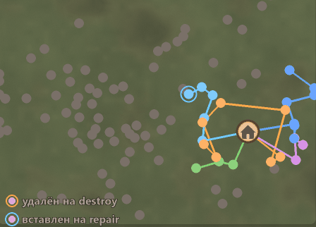
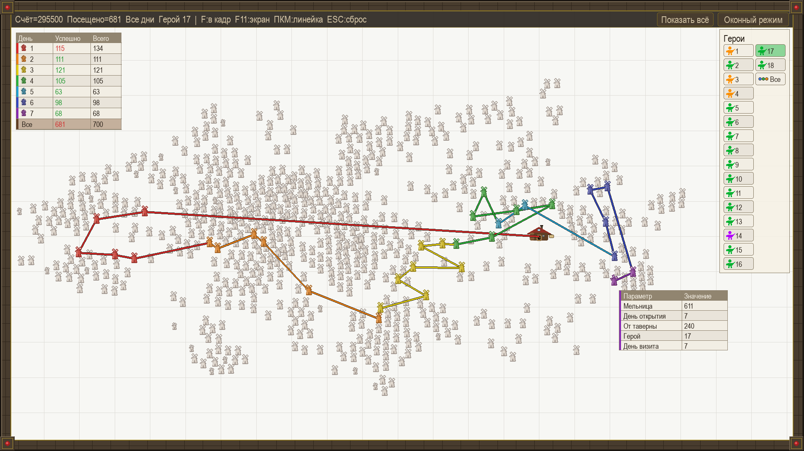
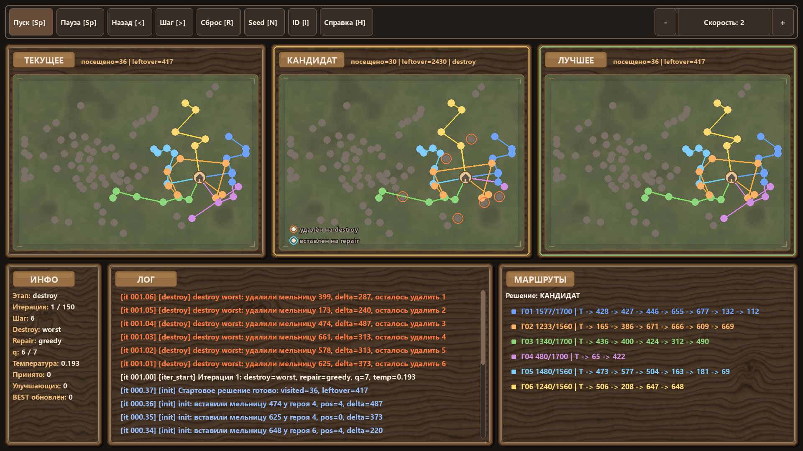

# Data Fusion Contest 2026 — Задача 3 "Герои"

Репозиторий с примерами решений, визуализаторами и учебными материалами для задачи маршрутизации героев с временными окнами (VRPTW) из соревнования [Data Fusion Contest 2026 - Герои](https://ods.ai/competitions/data-fusion2026-heroes).

## О чём задача

Есть:

- стартовая таверна/замок;
- набор героев с разным дневным запасом очков хода;
- набор объектов с золотом (мельницы);
- расстояния от таверны до объектов и между объектами;
- ограничение по дням: каждая мельница приносит золото **только в свой день открытия**.

Нужно построить маршруты героев так, чтобы за неделю собрать как можно больше золота.

### Метрика

$$
\text{Score} = \sum_i reward_i \cdot \mathbf{1}_{on\text{-}time_i} - 2500 \cdot \max(hero\_id)
$$

Где:

- `reward_i = 500` для каждой мельницы;
- объект приносит награду только если посещён вовремя;
- штраф считается по **максимальному использованному `hero_id`**, потому что герои нанимаются последовательно.

## Как решаем

В данном репозитории приведены два совершенно разных решения.

Первое решение — это **LNS** (Large Neighborhood Search). LNS — это эвристический метод "разрушай и восстанавливай".



Основная идея:
1. строим начальное решение;
2. удаляем часть уже построенных маршрутов (фаза `destroy`);
3. восстанавливаем решение другим способом (фаза `repair`);
4. повторяем много раз;
5. сохраняем лучшее найденное решение.

Даже самая простая реализация LNS позволяет получить скор **295500** за несколько минут для 17, 18 и 19 героев. Более подробно об LNS-решении написано [здесь](docs/lns_solver.md).

Разновидности LNS (например, ALNS) являются SOTA-подходом (State Of The Art) для решения VRP-задач.

Совершенно другой подход к решению задачи — это использование **MIP**-солверов (Mixed Integer Programming). MIP — это математическая оптимизация с бинарными и непрерывными переменными.

Основная идея:
1. Преобразуем задачу в систему линейных уравнений.
2. Решаем задачу линейной оптимизации с помощью MIP-солвера.
3. Преобразуем полученное решение обратно в маршруты для героев.

Основное преимущество данного подхода перед эвристическими алгоритмами в том, что MIP-солвер не только ищет решение, но и вычисляет **upper-bound оценку** оптимального решения. То есть солвер может **математически доказать** является ли наше решение оптимальным или нет.

К сожалению, размерность этой задачи слишком велика для open-source солверов (типа HiGHS), но если у вас есть доступ к коммерческим солверам (например, Gurobi), то вы можете попробовать не только найти решение, но и **доказать** что оно оптимальное.

[Здесь](docs/mip_solver_day1.md) описана модель для поиска оптимального решения для **первого дня**.

## Что содержит этот репозиторий

### Основные программы

- **`lns_demo.py`** — интерактивная демонстрация работы алгоритма LNS.
- **`lns_solver.py`** — Python-реализация LNS-солвера.
- **`lns_solver.cpp`** — C++ реализация LNS-солвера (работает в **50–100 раз быстрее**).
- **`mip_solver_day1.py`** — MIP-солвер для **первого дня**.
- **`view_solution.py`** — визуализатор готового решения.

### Ожидаемые входные файлы

В папке с данными должны лежать:

- `data_heroes.csv`
- `data_objects.csv`
- `dist_start.csv`
- `dist_objects.csv`

Ожидаемая структура такая:

```text
repo/
├─ data/
│  ├─ data_heroes.csv
│  ├─ data_objects.csv
│  ├─ dist_start.csv
│  └─ dist_objects.csv
├─ lns_demo.py
├─ lns_solver.py
├─ lns_solver.cpp
├─ mip_solver_day1.py
├─ view_solution.py
└─ README.md
```

## Быстрый старт

```bash
g++ -O3 -std=c++20 -o lns_solver lns_solver.cpp
./lns_solver
```

После завершения работы (меньше 10 минут) в папке `out_lns` будет лежать файл `submission.csv`, который достигает скора **295500** с **17** героями.

## Установка

### Требования

- Python **3.11**, **3.12** или **3.13** (`pygame` не поддерживает версию **3.14** и выше)
- для `lns_solver.cpp` — компилятор C++ с поддержкой **C++20**

### Python-зависимости

Установите базовые зависимости:

```bash
pip install numpy pandas polars pygame pulp highspy
```

- `pygame` - нужен для визуализаторов
- `pulp` - универсальный интерфейс к MIB-солверам
- `highspy` - open-source солвер HiGHS

## Просмотр готового решения

Для просмотра готового решения можно воспользоваться программой `view_solution.py`:

```bash
python view_solution.py --solution out_lns/submission.csv
```



Программа показывает карту, таверну, мельницы и маршруты героев.

### Управление

#### Мышь
- **Левая кнопка** — двигать карту
- **Колёсико** — приблизить / отдалить
- **Правая кнопка по мельнице** — поставить метку и смотреть расстояния

#### Клавиши
- **F** или **R** — показать все мельницы
- **F11** — полный экран
- **ESC** — сбросить выделение или выйти

## Визуализация алгоритма LNS

Программа `lns_demo.py` позволяет по шагам посмотреть как работает алгоритм LNS:

```bash
python lns_demo.py
```



Программа показывает как:
- строится начальное решение;
- часть объектов удаляется (на фазе `destroy`);
- потом решение восстанавливается (на фазе `repair`);
- кандидат либо принимается, либо отклоняется;
- лучшее найденное решение сохраняется.

На экране одновременно показываются три решения:

- **ТЕКУЩЕЕ** — текущее принятое решение
- **КАНДИДАТ** — решение, которое сейчас меняется
- **ЛУЧШЕЕ** — лучший найденный вариант

### Управление

#### Клавиши
- **Space** — пуск / пауза
- **Left** — шаг назад
- **Right** — шаг вперёд
- **Up / Down** — увеличить / уменьшить скорость
- **F** — полный экран
- **R** — перезапуск с тем же seed
- **N** — новый seed
- **I** — показать / скрыть ID объектов
- **H** — показать / скрыть справку
- **ESC** — закрыть справку или выйти

#### Мышь
- Наведение на объект показывает подсказку
- Наведение на сегмент маршрута показывает длину перехода
- Наведение на лог подсвечивает связанные объекты
- Наведение на маршруты подсвечивает путь героя
